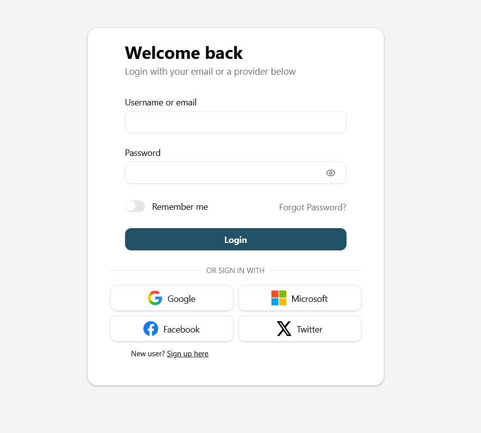

<p align="center">
    <i>🚀 <a href="https://subtype.space">subcloakify</a> a free, tailwindcss v4 based Keycloak theme 🚀</i>
    <br/>
    <br/>
</p>



# Quick start

Download the corresponding jar from the releases page, and drop it into your keycloak providers folder. If you use Phase 2 Keycloak, follow their instructions

# Environment variables
You can specify a URL pointing to your logo to be displayed on the main login page

# Building the theme

You need to have [Maven](https://maven.apache.org/) installed to build the theme (Maven >= 3.1.1, Java >= 7).  
The `mvn` command must be in the $PATH.

-   On macOS: `brew install maven`
-   On Debian/Ubuntu: `sudo apt-get install maven`
-   On Windows: `choco install openjdk` and `choco install maven` (Or download from [here](https://maven.apache.org/download.cgi))

```bash
npm run build-keycloak-theme
```
